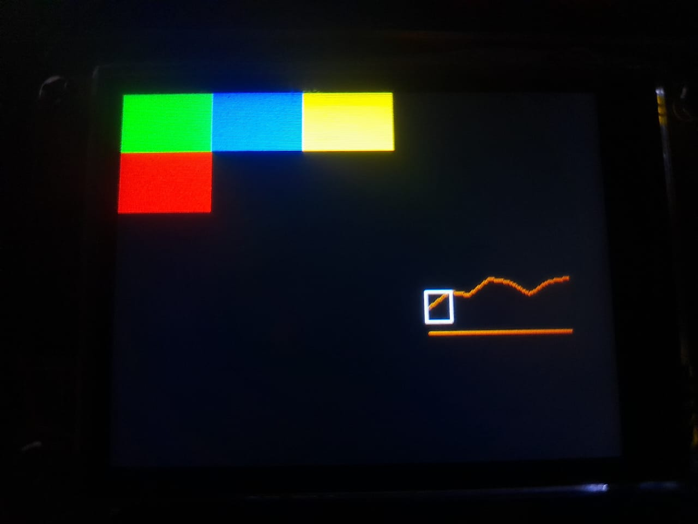

<h1> 
Key-cloner-like-flipper
 </h1>

planeo que sea un port del key cloner del flipper zero, que copia llaves físicas (de cerraduras comunes)

https://www.Apashura2.com entra a mi pagina, no tiene nada que ver con el proyecto

se implementaron:
* Medidas Fisicas Reales
* División en 8 secciones
* Tamaño de llave

Detalles a implementar: 
* Poner los botones del lado izquierdo para mayor comodidad
* Contador de los bits para ingresarlos al key gen

<h3> 
Versión 0.2.8
 </h3>
  

